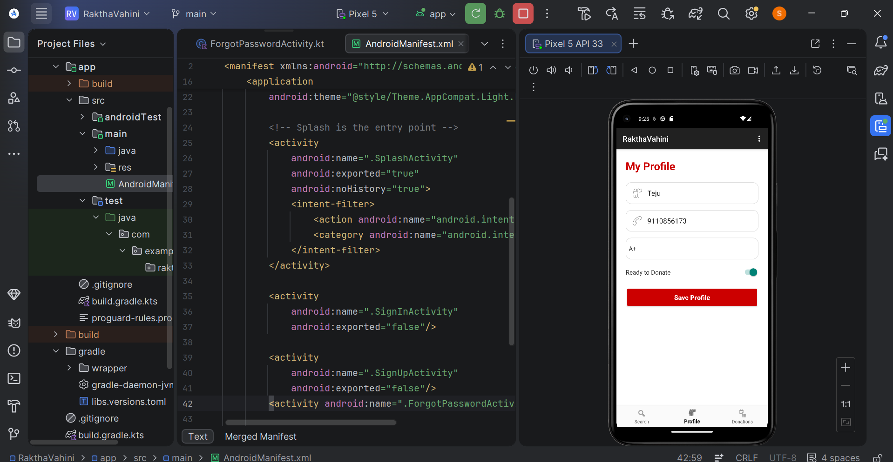
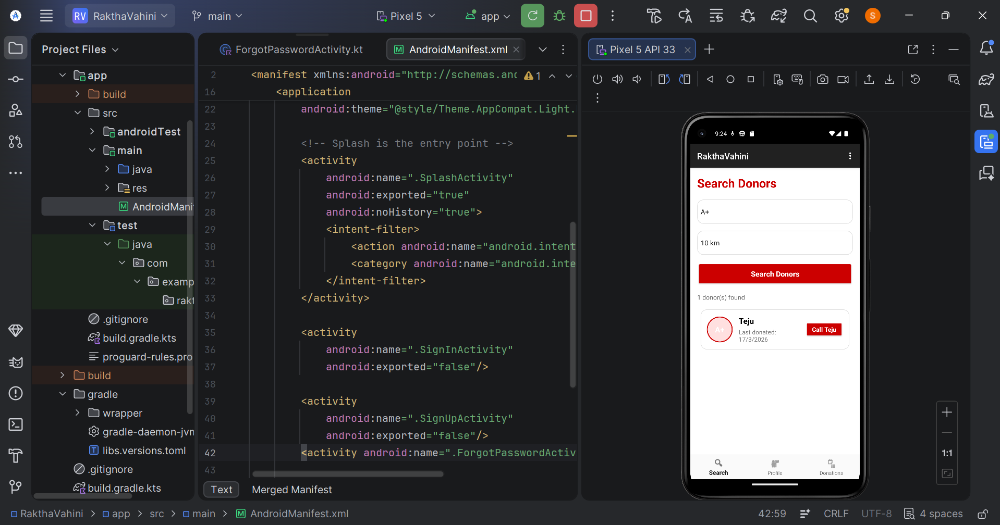
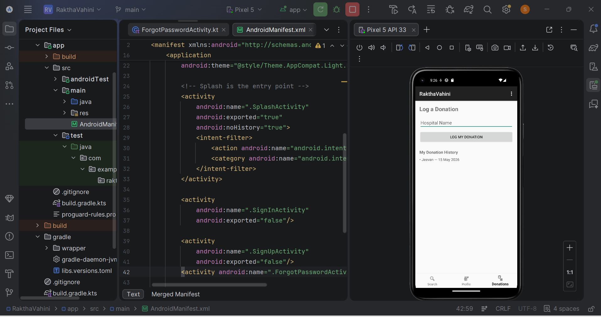

# Rakta-Vahini - Blood Donor Emergency App

## Project Title
Android App Development using GenAI - Rakta Vahini (Healthcare)

---

## Problem Statement

In emergency situations, people often depend on WhatsApp mass forwarding messages to find blood donors. These messages may not reach the correct donor group at the right time. There is no proper system to filter donors based on blood group availability and donation eligibility.

---

## Project Description

Rakta Vahini is a privacy-focused blood donor network application developed for emergency healthcare support. The app helps users quickly find eligible blood donors based on blood group, donation history, and location.

The system filters donors who are currently eligible to donate blood (not donated within the last 90 days). This reduces the time required to find donors during emergencies and improves communication between patients and donors.

The application is especially useful for rural hospitals, emergency healthcare centers, and volunteer blood donation communities.

---

## Features

- User Registration and Login
- Blood Donor Profile Management
- Blood Group Filtering
- Donation Eligibility Check
- Emergency Donor Search
- Nearby Donor Filtering
- Donation History Tracking
- "Ready to Donate" Availability Toggle
- Thank You Notification After Donation
- Room Database 

---

## Technologies Used

### Frontend
- Kotlin
- XML Layouts
- Android Studio

### Backend & Database
- Room Database

### Other Tools
- Git & GitHub
- GenAI Assistance
- Android SDK

---

## App Usage & User Flow

### 1. Donor Registration
Users register with:
- Name
- Blood Group
- Phone Number
- Location
- Last Donation Date

### 2. Emergency Search
Patients or hospitals:
- Select required blood group
- View eligible nearby donors
- Contact donor directly

### 3. Eligibility Logic
The app checks:

(Current Date - Last Donation Date > 90 Days)

Only eligible donors are shown in search results.

### 4. Donation Tracking
Users can:
- Log donation history
- Update availability
- Receive thank you notifications

---

## Security & Privacy

- Donor phone numbers are protected
- Intents are used for calling donors
- No public sharing of donor data
- Secureauthentication

---

## Impact Goals

### Medical Efficiency
Reduce time taken to find blood donors during emergencies.

### Data Privacy
Replace public WhatsApp forwarding systems with a secure donor directory.

### Volunteer Encouragement
Promote regular blood donation using digital tracking and reminders.

---

## Success Criteria

- Donors who donated within 90 days must be hidden from search results.
- Thank you notification should appear after donation logging.
- Search results should filter donors correctly by blood group and availability.

---

## Installation & Setup

### Prerequisites
- Android Studio
- Android Device or Emulator

### Steps to Run the Project

1. Clone the repository

```bash
git clone https://github.com/Tejashwini0505/Raktha-Vahini.git

## Screenshots

### Login Screen


## signup
(screenshots/sign-up.png)
## signup
(screenshots/forgot password.png)

### profile


### Donor Search


### Donation History


## Live url
https://drive.google.com/file/d/1IDy_Vf9H0UFGKEnuR7W57OHNRhYaVRGq/view?pli=1
